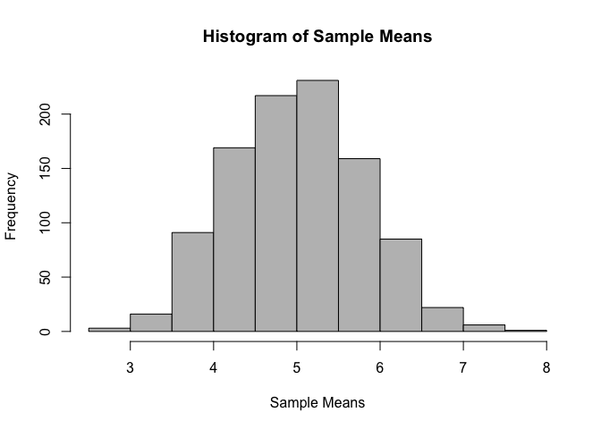
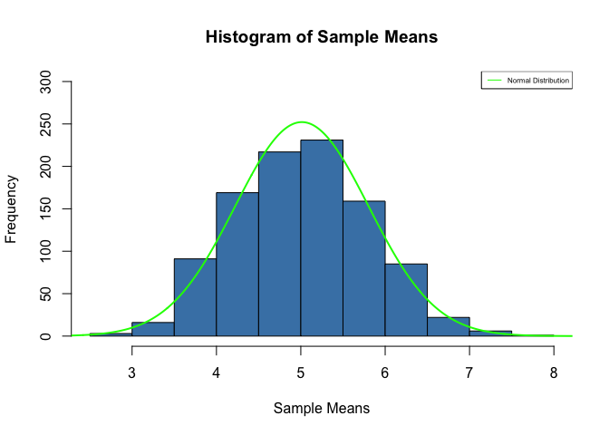
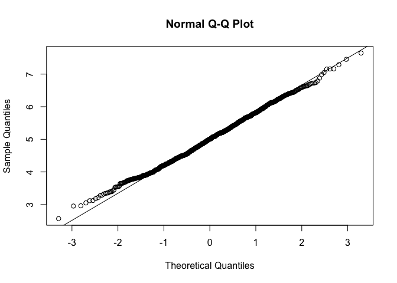

# Course Project Part 1
Ming Wei SIW  

#Overview

This study will compare between the normal distribution and a sampling distribution of 40 exponentials. Through the use of numerical and graphical comparisons and a normality test, it is established that the sampling distribution of 40 exponentials are quite normally distributed.

#Simulations

##Set Seed


```r
set.seed(100796)
```

##Parameters of Simulation


```r
lambda <- 0.2
nsim <- 1000
n <- 40
```

##1000 Simulations of 40 Exponentials


```r
sim <- rexp(n*nsim, lambda)
#create data frame of 1000 rows (frequency of simulation) and 40 columns
data2 <- data.frame(matrix(sim, nsim, n))
```

#Sample Mean vs Theoretical Mean

##Theoretical Mean


```r
t.mn <- 1/lambda
```

##Mean of Simulated Exponentials


```r
#mean of each simulation
mn.1000 <- apply(data2, 1, mean)
#mean of sampling distribution
mn <- mean(mn.1000)
```

The mean of the sampling distribution is 5.0124123 while the theoretical mean is 5. This shows that the sampling distribution has a mean that is very close to the true theoretical mean.

##Histogram of Simulated Exponentials


```r
hist(mn.1000, xlab = "Sample Means", main = "Histogram of Sample Means",
     col = "grey")
```

<!-- -->

This histogram further affirms the claim made above.

---

#Sample Variance vs Theoretical Variance

##Theoretical Variance


```r
t.var <- (1/lambda)^2
```

##Variance of Simulated Exponentials


```r
#variance of each simulation
var.1000 <- apply(data2, 1, var)
#variance of sampling distribution
var <- mean(var.1000)
```

The variance of the sampling distribution is 25.1141894 relative to the theoretical variance of 25, of which difference is 0.1141894. This suggests small discrepancy between the two.

---

#Distribution

##Histogram of Sampling Distribution vs Normal Distribution


```r
#plot histogram of sample means
h <- hist(mn.1000, xlab = "Sample Means", 
          main = "Histogram of Sample Means", col = "steelblue",
          ylim = c(0, 300))
#plot normal distribution
xfit <- seq(1, 1000, length = 100000)
yfit <- dnorm(xfit, mean = mean(mn.1000), sd = sd(mn.1000))
yfit <- yfit*diff(h$mids[1:2])*length(mn.1000)
lines(xfit, yfit, col = "green", lwd = 2)
#include legend
legend("topright", c("Normal Distribution"),
       col = "green", lty = 1, cex = 0.5)
```

<!-- -->

By comparing between the curve and the histogram, it is clear that these two seems to be close to each other.

##QQ-plot


```r
qqnorm(mn.1000); qqline(mn.1000)
```

<!-- -->

Normal QQ plot further suggests that the sampling distribution is very close to the normal distribution.

##Pearson Test for Normality


```r
require(nortest)
```

```
## Loading required package: nortest
```

```r
pearson.test(mn.1000)
```

```
## 
## 	Pearson chi-square normality test
## 
## data:  mn.1000
## P = 33.472, p-value = 0.2591
```

Finally, Pearson test shows that this sampling distribution is close to normal as H0 of normality is not rejected at 5%.
