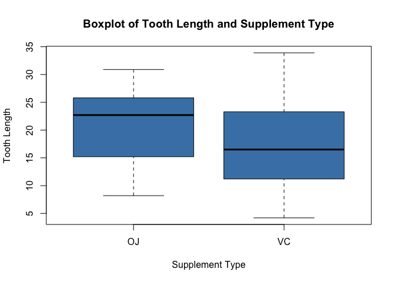
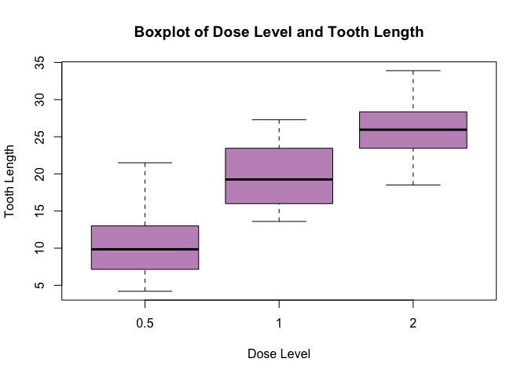
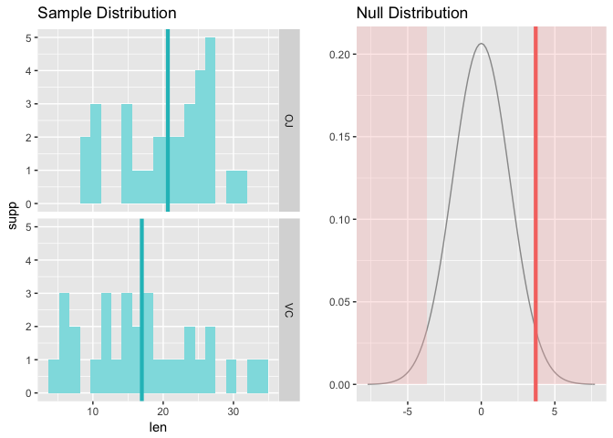
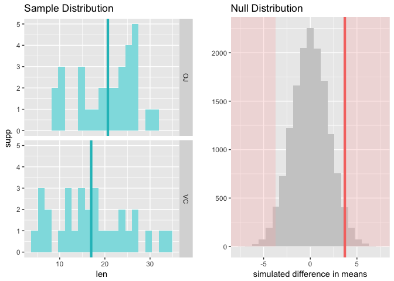

# Course Project Part 2
Ming Wei SIW  

#Overview


#Data Analysis

##Load Data


```r
library(datasets)
data("ToothGrowth")
```

##Explore the Data


```r
str(ToothGrowth)
```

```
## 'data.frame':	60 obs. of  3 variables:
##  $ len : num  4.2 11.5 7.3 5.8 6.4 10 11.2 11.2 5.2 7 ...
##  $ supp: Factor w/ 2 levels "OJ","VC": 2 2 2 2 2 2 2 2 2 2 ...
##  $ dose: num  0.5 0.5 0.5 0.5 0.5 0.5 0.5 0.5 0.5 0.5 ...
```

```r
#convert dose to a categorical variable
ToothGrowth$dose <- as.factor(ToothGrowth$dose)
```

Since there is a categorical variable involved, boxplots may be a good exploratory plot.

###Boxplot


```r
with(ToothGrowth,
  boxplot(len ~ supp, col = "steelblue", 
          main = "Boxplot of Tooth Length and Supplement Type",
          ylab = "Tooth Length", xlab = "Supplement Type"))
```

<!-- -->

The median of tooth length when supplement type is OJ seems to be higher than when supplement type is VC.

###Boxplot of Dose Level and Tooth Length


```r
with(ToothGrowth,
     plot(len ~ dose, col = rgb(0.5, 0, 0.5, 0.5), 
          xlab = "Dose Level", ylab = "Tooth Length",
          main = "Boxplot of Dose Level and Tooth Length"))
```

<!-- -->

Based on this boxplot, high dose level seems to be linked to greater tooth length.

##Data Summary


```r
summary(ToothGrowth)
```

```
##       len        supp     dose   
##  Min.   : 4.20   OJ:30   0.5:20  
##  1st Qu.:13.07   VC:30   1  :20  
##  Median :19.25           2  :20  
##  Mean   :18.81                   
##  3rd Qu.:25.27                   
##  Max.   :33.90
```

##Summary of Tooth Length by Supplement Type


```r
tapply(ToothGrowth$len, ToothGrowth$supp, summary)
```

```
## $OJ
##    Min. 1st Qu.  Median    Mean 3rd Qu.    Max. 
##    8.20   15.52   22.70   20.66   25.72   30.90 
## 
## $VC
##    Min. 1st Qu.  Median    Mean 3rd Qu.    Max. 
##    4.20   11.20   16.50   16.96   23.10   33.90
```

Supplement type OJ seems to yield greater tooth growth than supplement type VC.

##Summary of Tooth Length by Dose Level


```r
tapply(ToothGrowth$len, ToothGrowth$dose, summary)
```

```
## $`0.5`
##    Min. 1st Qu.  Median    Mean 3rd Qu.    Max. 
##   4.200   7.225   9.850  10.600  12.250  21.500 
## 
## $`1`
##    Min. 1st Qu.  Median    Mean 3rd Qu.    Max. 
##   13.60   16.25   19.25   19.74   23.38   27.30 
## 
## $`2`
##    Min. 1st Qu.  Median    Mean 3rd Qu.    Max. 
##   18.50   23.52   25.95   26.10   27.83   33.90
```

Higher dose level is shown to have greater mean of tooth growth.

##Hypothesis Test

###Mean of Tooth Length by Supplement Type


```r
require(statsr)
```

```
## Loading required package: statsr
```

```r
inference(len, supp, data = ToothGrowth, type = "ht", statistic = "mean",
          method = "theoretical", alternative = "twosided")
```

```
## Warning: Missing null value, set to 0
```

```
## Response variable: numerical
## Explanatory variable: categorical (2 levels) 
## n_OJ = 30, y_bar_OJ = 20.6633, s_OJ = 6.6056
## n_VC = 30, y_bar_VC = 16.9633, s_VC = 8.266
## H0: mu_OJ =  mu_VC
## HA: mu_OJ != mu_VC
## t = 1.9153, df = 29
## p_value = 0.0654
```

<!-- -->

As p value of hypothesis test is still above 0.05, do not reject null hypothesis that mean values are equal for both supplement type.

###Mean of Tooth Length by Supplement Type (Bootstrap)


```r
inference(len, supp, data = ToothGrowth, type = "ht", statistic = "mean",
          method = "simulation", alternative = "twosided")
```

```
## Warning: Missing null value, set to 0
```

```
## Response variable: numerical
## Explanatory variable: categorical (2 levels) 
## n_OJ = 30, y_bar_OJ = 20.6633, s_OJ = 10.2
## n_VC = 30, y_bar_VC = 16.9633, s_VC = 11.9
## H0: mu_OJ =  mu_VC
## HA: mu_OJ != mu_VC
## p_value = 0.0588
```

<!-- -->

Via bootstrapping with 15000 replications, the p value of hypothesis test is still above 0.05, thus null of equal means between tooth length of different supplement type is not rejected.

###Assumption for Hypothesis Test

- Variables in the dataset must be IID (Independent and Identically Distributed)

- Tooth Growth follows a normal distribution

